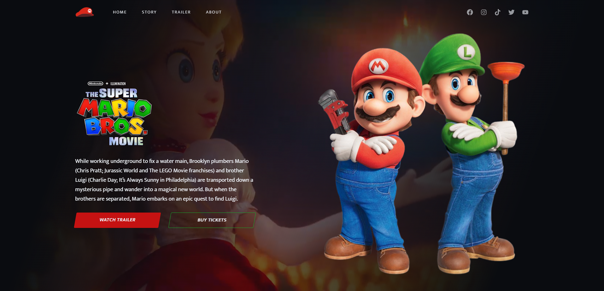

<h1 align="center">
  The Super Mario Bros. Movie
</h1>

  

O projeto foi construído nesse [vídeo](https://www.youtube.com/watch?v=6Ok-kUrBGp8) e faz o uso semântico do HTML, CSS flexbox, efeitos com a propriedade transform, carregamento de vídeo no background e animações com a biblioteca AOS animate.